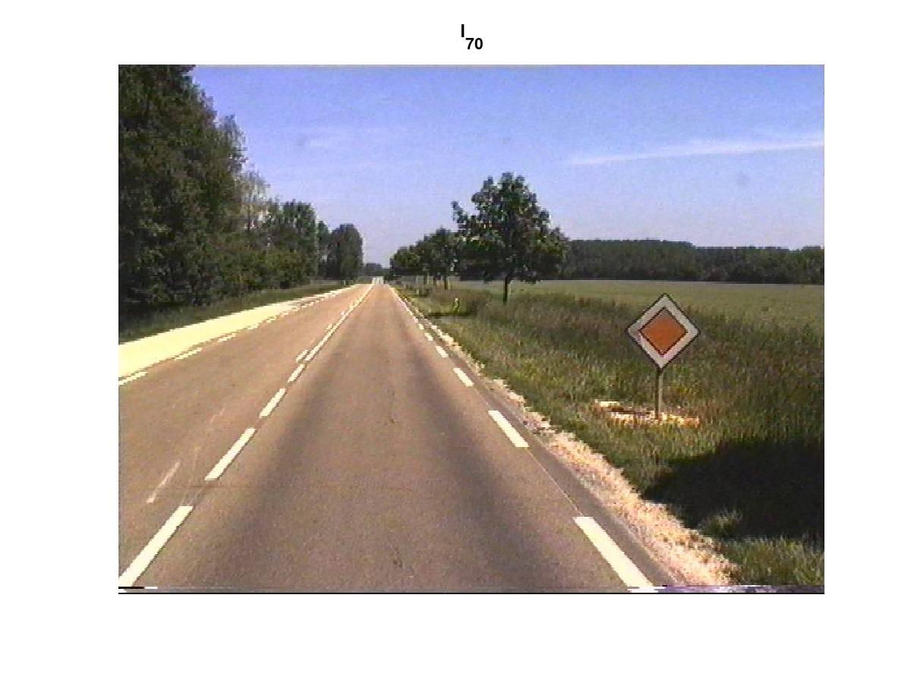
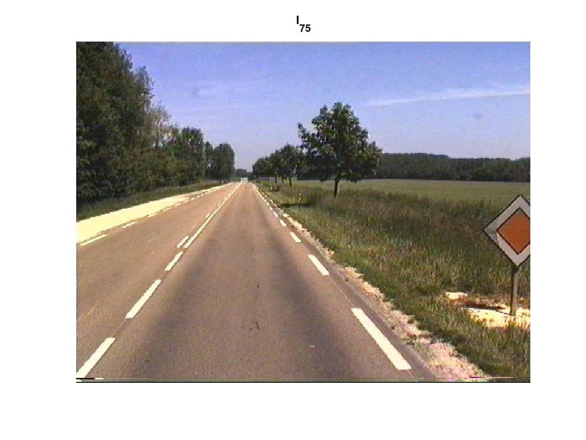
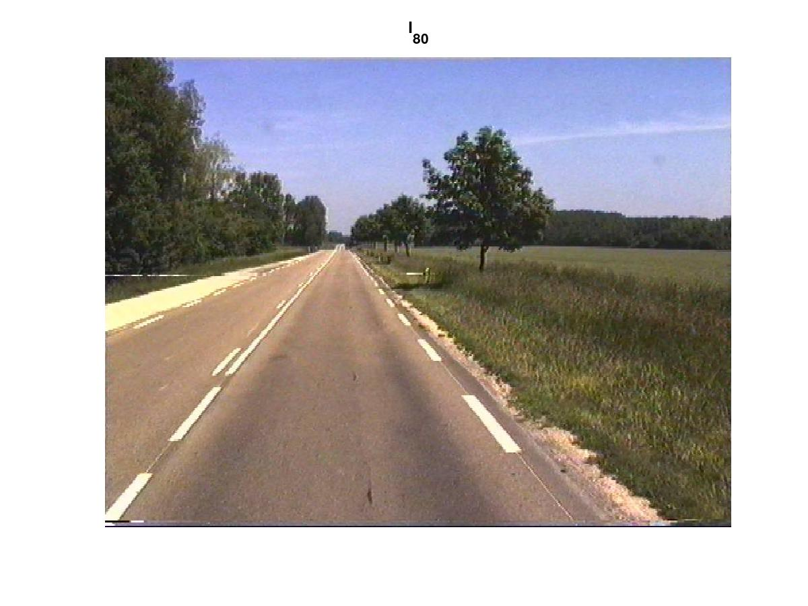
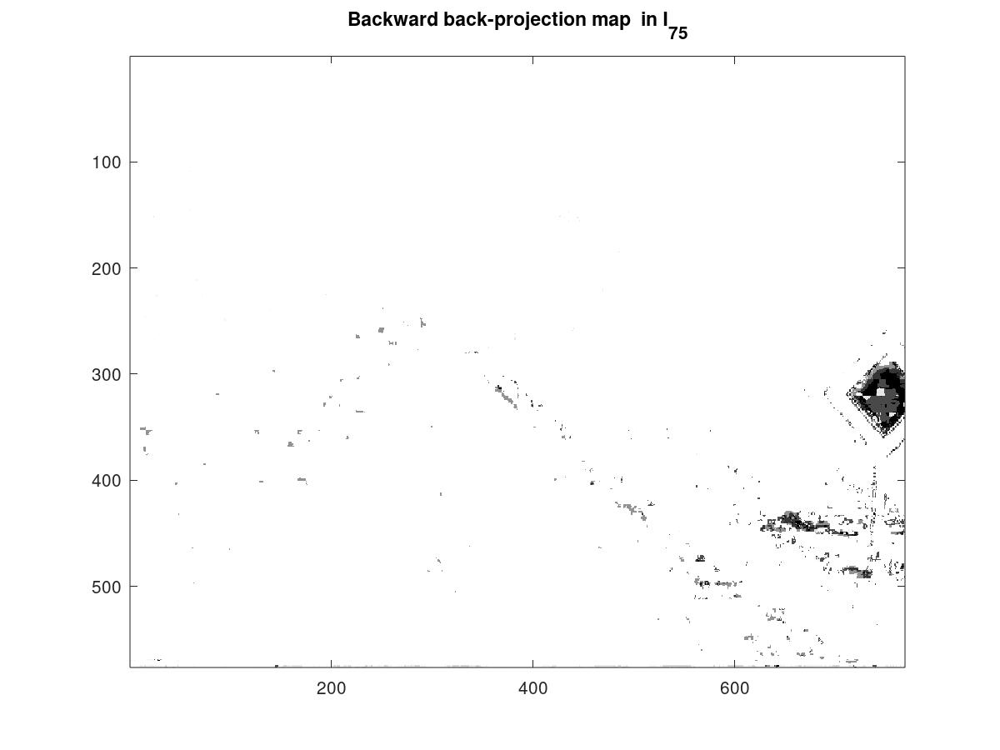
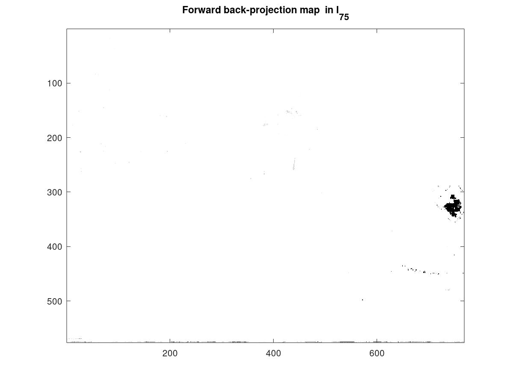

# ICIP-2001: Unsupervised Statistical Detection of Changing Objects in Camera-in-Motion Video

This package contains Matlab/Octave code associated with the following publication: 

```
[1] Unsupervised Statistical Detection of Changing Objects in Camera-in-Motion Video
R. Dahyot, P. Charbonnier and F. Heitz, 
IEEE International Conference on Image Processing (ICIP'01), October 2001, Greece.
DOI:10.1109/ICIP.2001.959126
```

See [Preprint](paper/htm_icip2001.pdf)  or [DOI:10.1109/ICIP.2001.959126](http://dx.doi.org/10.1109/ICIP.2001.959126)

Please cite this ICIP conference paper when using this code and pictures. 

## Getting started in Octave/Matlab

Demo is launched by typing in the command window of Octave or Matlab:

> RzDDemoICIP2001 


This code reproduces the results shown in Fig.1 of the [paper](paper/htm_icip2001.pdf) :






## Author: 

[Rozenn Dahyot](https://roznn.github.io/)
