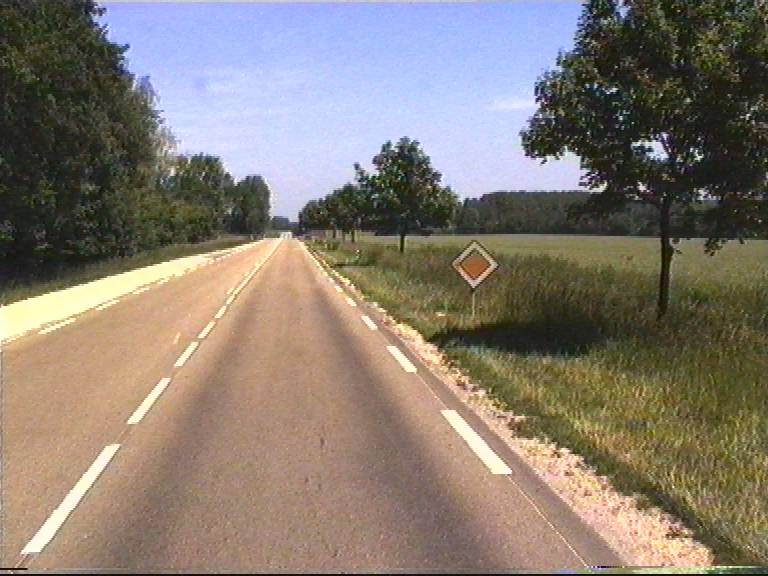
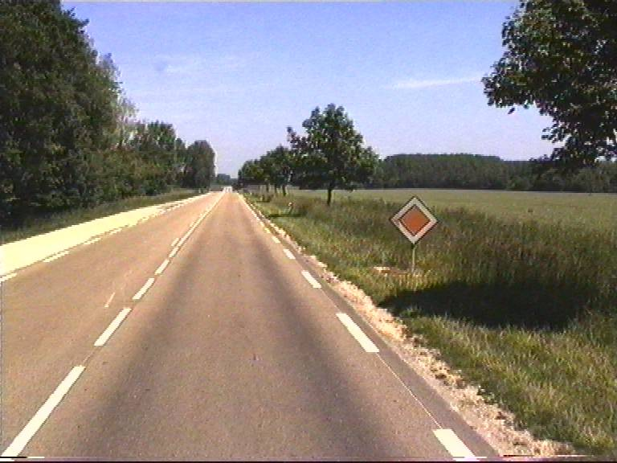
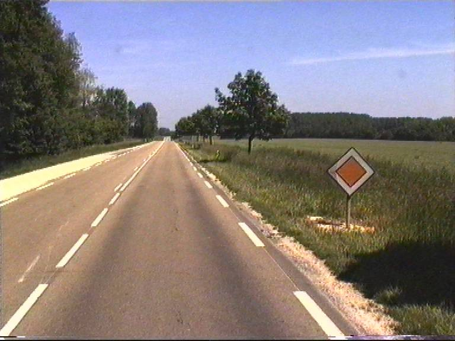
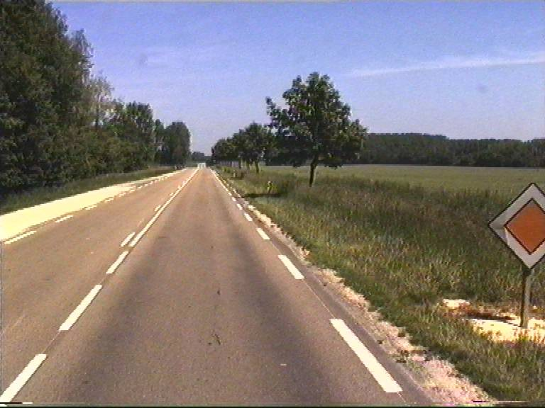
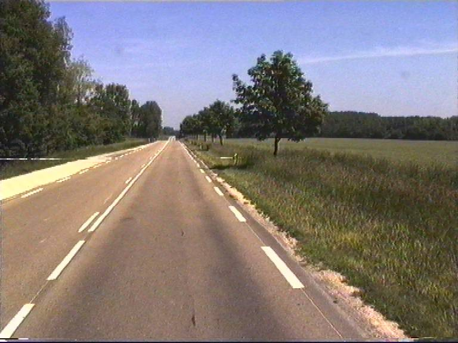

# ICIP-2001: Unsupervised Statistical Detection of Changing Objects in Camera-in-Motion Video

Matlab/Octave code associated with the following publication: 

> Unsupervised Statistical Detection of Changing Objects in Camera-in-Motion Video
R. Dahyot, P. Charbonnier and F. Heitz, IEEE International Conference on Image Processing (ICIP'01), October 2001, Greece.
see [Preprint](paper/htm_icip2001.pdf)  or [DOI:10.1109/ICIP.2001.959126](http://dx.doi.org/10.1109/ICIP.2001.959126)

## Getting started in Octave

## Examples

## Author: 

[Rozenn Dahyot](https://www.scss.tcd.ie/Rozenn.Dahyot/)
